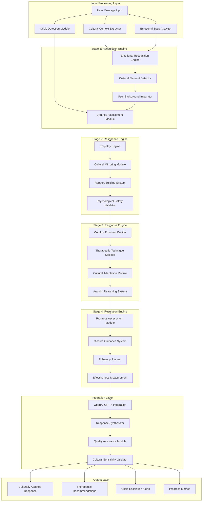

# Design Document

## Overview

The ArambhGPT AI Core System is designed as a sophisticated multi-stage emotional intelligence platform that combines OpenAI GPT-4 with custom cultural intelligence models. The architecture implements a research-validated four-stage comfort provision framework (Recognition, Resonance, Response, Resolution) specifically tailored for South Asian mental health contexts. The system emphasizes sukoon (peace) and arambh (new beginning) concepts while maintaining therapeutic appropriateness and crisis detection capabilities.

## Architecture

### AI Core System Architecture



### Technology Stack

**Core AI Components:**
- OpenAI GPT-4 API for advanced language understanding and generation
- Custom transformer models for cultural context analysis
- BERT-based models for emotional state classification
- spaCy for Hindi/Urdu NLP processing
- scikit-learn for cultural pattern recognition

**Cultural Intelligence:**
- Custom Hindi/Urdu phrase recognition models
- Cultural reference databases for Indian/South Asian contexts
- Religious and spiritual context detection systems
- Regional communication pattern analyzers

**Therapeutic Framework:**
- Evidence-based therapeutic technique library
- Crisis detection and escalation algorithms
- Sukoon (peace) measurement metrics
- Arambh (new beginning) reframing techniques

## Components and Interfaces

### Stage 1: Recognition Engine Implementation

#### Emotional Recognition Engine
```python
from typing import Dict, List, Optional
from dataclasses import dataclass
from enum import Enum

class EmotionType(Enum):
    JOY = "joy"
    SADNESS = "sadness"
    ANXIETY = "anxiety"
    ANGER = "anger"
    FEAR = "fear"
    SUKOON = "sukoon"  # peace/comfort
    PARESHANI = "pareshani"  # distress

@dataclass
class EmotionalState:
    primary_emotion: EmotionType
    intensity: float  # 0.0 to 1.0
    secondary_emotions: List[EmotionType]
    confidence_score: float
    cultural_markers: List[str]
    sukoon_level: float  # 0.0 to 10.0

class EmotionalRecognitionEngine:
    def __init__(self):
        self.emotion_classifier = self._load_emotion_model()
        self.cultural_detector = self._load_cultural_model()
        self.hindi_urdu_processor = self._load_language_processor()
    
    async def analyze_user_input(
        self, 
        message: str, 
        cultural_context: Dict,
        user_history: Optional[Dict] = None
    ) -> EmotionalState:
        """
        Analyze user input for emotional state and cultural context
        """
        # Preprocess text for Hindi/Urdu elements
        processed_text = await self._preprocess_multilingual_text(message)
        
        # Extract emotional indicators
        emotional_features = await self._extract_emotional_features(processed_text)
        
        # Analyze cultural context
        cultural_elements = await self.detect_cultural_elements(
            processed_text, cultural_context
        )
        
        # Integrate user background if available
        if user_history:
            emotional_features = await self._integrate_user_background(
                emotional_features, user_history
            )
        
        # Classify primary emotion
        primary_emotion = await self._classify_primary_emotion(emotional_features)
        
        # Calculate sukoon level
        sukoon_level = await self._calculate_sukoon_level(
            emotional_features, cultural_elements
        )
        
        return EmotionalState(
            primary_emotion=primary_emotion,
            intensity=emotional_features.get('intensity', 0.5),
            secondary_emotions=emotional_features.get('secondary_emotions', []),
            confidence_score=emotional_features.get('confidence', 0.0),
            cultural_markers=cultural_elements.get('markers', []),
            sukoon_level=sukoon_level
        )
    
    async def detect_cultural_elements(
        self, 
        text: str, 
        user_profile: Dict
    ) -> Dict:
        """
        Detect cultural elements in user text
        """
        cultural_insights = {
            'hindi_urdu_phrases': [],
            'cultural_references': [],
            'religious_context': [],
            'regional_patterns': [],
            'family_dynamics': [],
            'traditional_concepts': []
        }
        
        # Hindi/Urdu phrase recognition
        hindi_urdu_phrases = await self._extract_hindi_urdu_phrases(text)
        cultural_insights['hindi_urdu_phrases'] = hindi_urdu_phrases
        
        # Cultural reference identification
        cultural_refs = await self._identify_cultural_references(text, user_profile)
        cultural_insights['cultural_references'] = cultural_refs
        
        # Religious/spiritual context detection
        religious_context = await self._detect_religious_context(text)
        cultural_insights['religious_context'] = religious_context
        
        # Regional communication patterns
        regional_patterns = await self._analyze_regional_patterns(
            text, user_profile.get('region', '')
        )
        cultural_insights['regional_patterns'] = regional_patterns
        
        return cultural_insights
```

### Stage 2: Resonance Engine Implementation

#### Empathy Engine
```python
@dataclass
class EmpathicResponse:
    resonant_message: str
    emotional_validation: str
    cultural_adaptation: str
    rapport_building_elements: List[str]
    psychological_safety_score: float

class EmpathyEngine:
    def __init__(self):
        self.cultural_communication_styles = self._load_cultural_styles()
        self.empathy_templates = self._load_empathy_templates()
        self.cultural_metaphors = self._load_cultural_metaphors()
    
    async def generate_empathetic_response(
        self, 
        emotional_state: EmotionalState, 
        cultural_context: Dict
    ) -> EmpathicResponse:
        """
        Generate culturally appropriate empathetic response
        """
        # Mirror emotional tone appropriately
        emotional_mirror = await self._mirror_emotional_tone(
            emotional_state, cultural_context
        )
        
        # Validate feelings without judgment
        validation_message = await self._create_validation_message(
            emotional_state, cultural_context
        )
        
        # Build rapport through cultural understanding
        rapport_elements = await self._build_cultural_rapport(
            cultural_context, emotional_state
        )
        
        # Ensure psychological safety
        safety_score = await self._assess_psychological_safety(
            emotional_mirror, validation_message, cultural_context
        )
        
        return EmpathicResponse(
            resonant_message=emotional_mirror,
            emotional_validation=validation_message,
            cultural_adaptation=await self.cultural_mirroring(cultural_context),
            rapport_building_elements=rapport_elements,
            psychological_safety_score=safety_score
        )
    
    async def cultural_mirroring(self, user_background: Dict) -> str:
        """
        Adapt communication style to cultural norms
        """
        cultural_style = user_background.get('cultural_background', {})
        region = cultural_style.get('region', 'general')
        community = cultural_style.get('community', 'general')
        
        # Select appropriate communication style
        communication_style = self.cultural_communication_styles.get(
            f"{region}_{community}", 
            self.cultural_communication_styles['default']
        )
        
        # Use appropriate metaphors and references
        metaphors = await self._select_cultural_metaphors(region, community)
        
        # Respect cultural boundaries and sensitivities
        boundaries = await self._identify_cultural_boundaries(cultural_style)
        
        adapted_communication = await self._adapt_communication_style(
            communication_style, metaphors, boundaries
        )
        
        return adapted_communication
```

### Stage 3: Response Engine Implementation

#### Comfort Provision Engine
```python
@dataclass
class SukoonResponse:
    comfort_message: str
    therapeutic_techniques: List[str]
    traditional_practices: List[str]
    coping_strategies: List[str]
    arambh_reframing: str
    sukoon_improvement_potential: float

class ComfortProvisionEngine:
    def __init__(self):
        self.therapeutic_techniques = self._load_therapeutic_library()
        self.traditional_practices = self._load_traditional_practices()
        self.sukoon_strategies = self._load_sukoon_strategies()
        self.arambh_frameworks = self._load_arambh_frameworks()
    
    async def provide_sukoon_response(
        self, 
        analysis_data: Dict
    ) -> SukoonResponse:
        """
        Generate culturally-appropriate comfort response
        """
        emotional_state = analysis_data['emotional_state']
        cultural_context = analysis_data['cultural_context']
        user_background = analysis_data.get('user_background', {})
        
        # Generate culturally-appropriate comfort
        comfort_message = await self._generate_sukoon_comfort(
            emotional_state, cultural_context
        )
        
        # Apply research-backed therapeutic techniques
        therapeutic_techniques = await self._select_therapeutic_techniques(
            emotional_state, cultural_context
        )
        
        # Integrate mindfulness and traditional practices
        traditional_practices = await self._integrate_traditional_practices(
            cultural_context, emotional_state
        )
        
        # Offer practical coping strategies
        coping_strategies = await self._generate_coping_strategies(
            emotional_state, cultural_context, user_background
        )
        
        # Apply arambh reframing
        arambh_reframing = await self.arambh_reframing(
            analysis_data.get('user_challenges', {})
        )
        
        # Calculate sukoon improvement potential
        sukoon_potential = await self._calculate_sukoon_potential(
            emotional_state, therapeutic_techniques, traditional_practices
        )
        
        return SukoonResponse(
            comfort_message=comfort_message,
            therapeutic_techniques=therapeutic_techniques,
            traditional_practices=traditional_practices,
            coping_strategies=coping_strategies,
            arambh_reframing=arambh_reframing,
            sukoon_improvement_potential=sukoon_potential
        )
    
    async def arambh_reframing(self, user_challenges: Dict) -> str:
        """
        Reframe difficulties as new beginnings (arambh)
        """
        challenges = user_challenges.get('current_challenges', [])
        cultural_context = user_challenges.get('cultural_context', {})
        
        # Reframe difficulties as opportunities
        reframed_challenges = []
        for challenge in challenges:
            reframed = await self._reframe_as_arambh(challenge, cultural_context)
            reframed_challenges.append(reframed)
        
        # Instill hope and positive perspective
        hope_message = await self._generate_hope_message(
            reframed_challenges, cultural_context
        )
        
        # Connect to cultural values of resilience
        resilience_connection = await self._connect_cultural_resilience(
            cultural_context, reframed_challenges
        )
        
        # Suggest actionable next steps
        next_steps = await self._suggest_actionable_steps(
            reframed_challenges, cultural_context
        )
        
        return f"{hope_message}\n\n{resilience_connection}\n\n{next_steps}"
```

### Stage 4: Resolution Engine Implementation

#### Resolution Engine
```python
@dataclass
class ResolutionGuidance:
    progress_assessment: Dict
    closure_techniques: List[str]
    follow_up_plan: Dict
    sukoon_achievement_score: float
    effectiveness_metrics: Dict

class ResolutionEngine:
    def __init__(self):
        self.progress_assessors = self._load_progress_assessors()
        self.closure_techniques = self._load_closure_techniques()
        self.follow_up_strategies = self._load_follow_up_strategies()
        self.effectiveness_calculators = self._load_effectiveness_calculators()
    
    async def guide_to_sukoon(
        self, 
        conversation_history: List[Dict]
    ) -> ResolutionGuidance:
        """
        Guide user toward emotional stability and peace
        """
        # Assess progress toward emotional stability
        progress_assessment = await self._assess_emotional_progress(
            conversation_history
        )
        
        # Provide closure and peace-making techniques
        closure_techniques = await self._select_closure_techniques(
            progress_assessment, conversation_history[-1].get('cultural_context', {})
        )
        
        # Ensure user feels heard and supported
        validation_check = await self._validate_user_support(
            conversation_history, progress_assessment
        )
        
        # Plan follow-up care if needed
        follow_up_plan = await self._plan_follow_up_care(
            progress_assessment, conversation_history
        )
        
        # Calculate sukoon achievement
        sukoon_score = await self._calculate_sukoon_achievement(
            conversation_history, progress_assessment
        )
        
        return ResolutionGuidance(
            progress_assessment=progress_assessment,
            closure_techniques=closure_techniques,
            follow_up_plan=follow_up_plan,
            sukoon_achievement_score=sukoon_score,
            effectiveness_metrics=await self.measure_effectiveness(
                {'conversation_history': conversation_history}
            )
        )
    
    async def measure_effectiveness(self, session_data: Dict) -> Dict:
        """
        Measure intervention effectiveness and cultural adaptation
        """
        conversation_history = session_data['conversation_history']
        
        # Track sukoon level improvement
        sukoon_improvement = await self._measure_sukoon_improvement(
            conversation_history
        )
        
        # Measure cultural adaptation success
        cultural_adaptation_success = await self._measure_cultural_adaptation(
            conversation_history
        )
        
        # Evaluate intervention effectiveness
        intervention_effectiveness = await self._evaluate_interventions(
            conversation_history
        )
        
        # Generate insights for optimization
        optimization_insights = await self._generate_optimization_insights(
            sukoon_improvement, cultural_adaptation_success, intervention_effectiveness
        )
        
        return {
            'sukoon_improvement': sukoon_improvement,
            'cultural_adaptation_success': cultural_adaptation_success,
            'intervention_effectiveness': intervention_effectiveness,
            'optimization_insights': optimization_insights,
            'overall_effectiveness_score': (
                sukoon_improvement + cultural_adaptation_success + intervention_effectiveness
            ) / 3
        }
```

### OpenAI GPT-4 Integration Layer

#### AI Integration Manager
```python
import openai
from typing import Dict, List, Optional

class AIIntegrationManager:
    def __init__(self, openai_api_key: str):
        self.openai_client = openai.AsyncOpenAI(api_key=openai_api_key)
        self.cultural_prompt_templates = self._load_cultural_prompts()
        self.therapeutic_guidelines = self._load_therapeutic_guidelines()
    
    async def generate_culturally_sensitive_response(
        self,
        user_message: str,
        emotional_analysis: EmotionalState,
        cultural_context: Dict,
        stage_outputs: Dict
    ) -> str:
        """
        Integrate all stage outputs with GPT-4 for final response generation
        """
        # Construct culturally-aware system prompt
        system_prompt = await self._build_cultural_system_prompt(
            cultural_context, emotional_analysis
        )
        
        # Prepare context from all stages
        stage_context = await self._prepare_stage_context(stage_outputs)
        
        # Create therapeutic guidelines context
        therapeutic_context = await self._prepare_therapeutic_context(
            emotional_analysis, cultural_context
        )
        
        # Generate response with GPT-4
        response = await self.openai_client.chat.completions.create(
            model="gpt-4",
            messages=[
                {"role": "system", "content": system_prompt},
                {"role": "user", "content": f"""
                User Message: {user_message}
                
                Emotional Analysis: {emotional_analysis}
                Cultural Context: {cultural_context}
                Stage Outputs: {stage_context}
                Therapeutic Guidelines: {therapeutic_context}
                
                Please provide a culturally sensitive, therapeutically appropriate response 
                that incorporates sukoon (peace) and arambh (new beginning) concepts.
                """}
            ],
            temperature=0.7,
            max_tokens=1000
        )
        
        generated_response = response.choices[0].message.content
        
        # Validate cultural sensitivity and therapeutic appropriateness
        validated_response = await self._validate_response_quality(
            generated_response, cultural_context, emotional_analysis
        )
        
        return validated_response
    
    async def detect_crisis_and_escalate(
        self, 
        user_message: str, 
        emotional_analysis: EmotionalState
    ) -> Dict:
        """
        Detect crisis situations and determine escalation needs
        """
        crisis_indicators = [
            "suicide", "self-harm", "hurt myself", "end it all",
            "मरना चाहता हूं", "خودکشی", "जीना नहीं चाहता"  # Hindi/Urdu crisis terms
        ]
        
        # Check for explicit crisis language
        explicit_crisis = any(indicator in user_message.lower() for indicator in crisis_indicators)
        
        # Analyze emotional intensity for implicit crisis
        implicit_crisis = (
            emotional_analysis.intensity > 0.8 and 
            emotional_analysis.primary_emotion in [EmotionType.SADNESS, EmotionType.FEAR] and
            emotional_analysis.sukoon_level < 2.0
        )
        
        crisis_level = "none"
        if explicit_crisis:
            crisis_level = "immediate"
        elif implicit_crisis:
            crisis_level = "high"
        elif emotional_analysis.sukoon_level < 4.0 and emotional_analysis.intensity > 0.6:
            crisis_level = "medium"
        
        return {
            'crisis_detected': crisis_level != "none",
            'crisis_level': crisis_level,
            'escalation_needed': crisis_level in ["immediate", "high"],
            'recommended_actions': await self._get_crisis_recommendations(crisis_level),
            'emergency_contacts': crisis_level == "immediate"
        }
```

## Data Models

### Core AI Response Models
```python
@dataclass
class AIResponse:
    message: str
    emotional_resonance_score: float
    cultural_sensitivity_score: float
    therapeutic_appropriateness_score: float
    sukoon_improvement_potential: float
    crisis_indicators: Dict
    follow_up_recommendations: List[str]
    effectiveness_prediction: float

@dataclass
class CulturalIntelligence:
    detected_language: str
    cultural_references: List[str]
    religious_context: Optional[str]
    regional_patterns: List[str]
    communication_style_adaptation: str
    cultural_sensitivity_score: float

@dataclass
class TherapeuticIntervention:
    intervention_type: str
    evidence_base: str
    cultural_adaptation: str
    expected_outcome: str
    sukoon_alignment: float
    arambh_potential: float
```

## Error Handling

### AI System Error Management
- **Model Failures**: Graceful degradation when AI models are unavailable
- **Cultural Misinterpretation**: Fallback to general therapeutic responses
- **Crisis Detection Failures**: Conservative escalation when uncertain
- **Language Processing Errors**: Multi-language fallback mechanisms
- **Response Quality Issues**: Automated quality validation and regeneration

### Therapeutic Safety Measures
- **Inappropriate Response Detection**: Automated filtering of harmful content
- **Cultural Insensitivity Alerts**: Real-time cultural appropriateness checking
- **Crisis Escalation Protocols**: Immediate human intervention triggers
- **Therapeutic Boundary Maintenance**: Ensure AI stays within appropriate scope
- **User Safety Monitoring**: Continuous assessment of user emotional state

## Testing Strategy

### AI Model Testing
- **Emotional Recognition Accuracy**: Test emotion classification across cultural contexts
- **Cultural Sensitivity Validation**: Verify appropriate cultural adaptations
- **Therapeutic Appropriateness**: Validate evidence-based therapeutic responses
- **Crisis Detection Reliability**: Test crisis identification and escalation
- **Sukoon Measurement Accuracy**: Validate peace/comfort level assessments

### Integration Testing
- **OpenAI GPT-4 Integration**: Test seamless integration with external AI services
- **Multi-stage Pipeline**: Validate data flow through all four stages
- **Cultural Intelligence Pipeline**: Test cultural context processing
- **Response Quality Assurance**: Automated quality validation testing
- **Performance Under Load**: Test system performance with high user volumes

### Cultural Validation Testing
- **Hindi/Urdu Language Processing**: Test multilingual capabilities
- **Regional Cultural Variations**: Validate responses across different South Asian regions
- **Religious Sensitivity**: Test appropriate handling of religious contexts
- **Traditional Practice Integration**: Validate incorporation of cultural healing methods
- **Community Feedback Integration**: Test system adaptation based on cultural community input