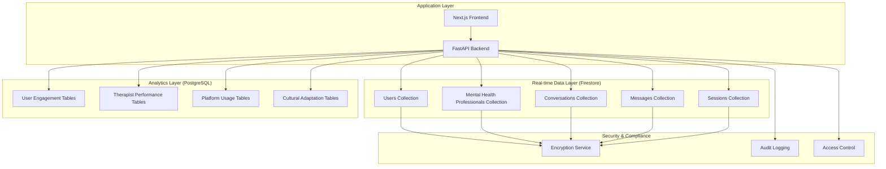

# Design Document

## Overview

The ArambhGPT Database Architecture is designed as a hybrid data storage system combining Firestore for real-time operations and PostgreSQL for analytics. The architecture prioritizes data security, cultural sensitivity, and compliance with healthcare regulations while supporting complex mental health workflows. The design ensures scalability for therapeutic services while maintaining the cultural context essential for South Asian mental health support.

## Architecture

### Database Architecture Overview



### Data Storage Strategy

**Firestore (Real-time Operations):**
- User profiles and preferences
- Therapist information and availability
- Active conversations and messages
- Live session data
- Real-time notifications and updates

**PostgreSQL (Analytics & Reporting):**
- Historical user engagement patterns
- Therapist performance metrics
- Platform usage statistics
- Cultural adaptation effectiveness data
- Aggregated wellness progression data

## Components and Interfaces

### Firestore Collections Design

#### Users Collection
```typescript
interface UserDocument {
  uid: string; // Firebase Auth ID
  profile: {
    name: string;
    email: string;
    phone?: string;
    avatar?: string;
    cultural_background: {
      region: string;
      community: string;
      languages: string[];
      religious_considerations?: string;
    };
    preferred_language: 'en' | 'hi' | 'ur';
    mental_health_history: {
      previous_therapy: boolean;
      current_medications?: string[];
      diagnosed_conditions?: string[];
      family_history?: string[];
      trauma_history?: string[];
    };
    emergency_contacts: Array<{
      name: string;
      relationship: string;
      phone: string;
      email?: string;
    }>;
  };
  subscription: {
    plan_type: 'free' | 'basic' | 'premium' | 'family';
    billing_cycle: 'monthly' | 'yearly';
    payment_status: 'active' | 'past_due' | 'cancelled';
    features_enabled: string[];
    usage_limits: {
      monthly_sessions: number;
      ai_interactions: number;
      storage_gb: number;
    };
  };
  preferences: {
    therapist_gender_preference?: 'male' | 'female' | 'no_preference';
    language_preference: string[];
    session_type_preference: ('chat' | 'audio' | 'video')[];
    cultural_considerations: {
      religious_accommodations: boolean;
      family_involvement_preference: 'high' | 'medium' | 'low';
      traditional_healing_integration: boolean;
    };
  };
  created_at: Timestamp;
  updated_at: Timestamp;
}
```

#### Mental Health Professionals Collection
```typescript
interface TherapistDocument {
  uid: string; // Firebase Auth ID
  profile: {
    name: string;
    credentials: string[];
    license_number: string;
    license_state: string;
    specializations: string[];
    languages_spoken: string[];
    experience_years: number;
    education: Array<{
      degree: string;
      institution: string;
      year: number;
    }>;
    bio: string;
    approach: string[];
  };
  verification: {
    license_verified: boolean;
    license_verification_date?: Timestamp;
    background_check: boolean;
    background_check_date?: Timestamp;
    platform_training_completed: boolean;
    training_completion_date?: Timestamp;
    verification_status: 'pending' | 'approved' | 'rejected';
  };
  availability: {
    schedule: {
      [day: string]: Array<{
        start_time: string;
        end_time: string;
        timezone: string;
      }>;
    };
    booking_slots: number; // minutes per slot
    advance_booking_days: number;
    session_types_offered: ('chat' | 'audio' | 'video')[];
    pricing: {
      chat_session: number;
      audio_session: number;
      video_session: number;
      currency: string;
    };
  };
  performance: {
    rating: number;
    total_sessions: number;
    user_reviews: Array<{
      user_id: string;
      rating: number;
      comment?: string;
      date: Timestamp;
    }>;
    response_time_avg: number; // minutes
    completion_rate: number; // percentage
    no_show_rate: number; // percentage
  };
  cultural_expertise: Array<{
    region: string;
    communities: string[];
    special_populations: string[];
    cultural_training: string[];
  }>;
  created_at: Timestamp;
  updated_at: Timestamp;
}
```

#### Conversations Collection
```typescript
interface ConversationDocument {
  id: string;
  participants: {
    user_id: string;
    therapist_id?: string;
    ai_involvement_level: 'none' | 'low' | 'medium' | 'high';
  };
  conversation_type: 'ai_only' | 'ai_human_hybrid' | 'human_only';
  metadata: {
    title: string;
    tags: string[];
    urgency_level: 'low' | 'medium' | 'high' | 'crisis';
    cultural_context: {
      primary_language: string;
      cultural_elements: string[];
      religious_context?: string;
    };
    language_used: string;
  };
  emotional_analysis: {
    initial_state: {
      mood: string;
      anxiety_level: number; // 1-10
      stress_level: number; // 1-10
      sukoon_level: number; // 1-10 (peace/comfort)
    };
    current_state: {
      mood: string;
      anxiety_level: number;
      stress_level: number;
      sukoon_level: number;
    };
    progress: {
      mood_improvement: number;
      anxiety_reduction: number;
      stress_reduction: number;
      sukoon_improvement: number;
    };
    comfort_progression: Array<{
      timestamp: Timestamp;
      comfort_level: number;
      notes?: string;
    }>;
    intervention_effectiveness: {
      ai_interventions: number;
      human_interventions: number;
      cultural_interventions: number;
      effectiveness_score: number;
    };
  };
  created_at: Timestamp;
  updated_at: Timestamp;
  last_activity: Timestamp;
}
```

#### Messages Collection
```typescript
interface MessageDocument {
  id: string;
  conversation_id: string;
  sender_info: {
    sender_id: string;
    sender_type: 'user' | 'ai' | 'therapist';
    sender_name: string;
    cultural_context?: {
      language_preference: string;
      cultural_background: string;
    };
  };
  content: {
    text: string;
    attachments?: Array<{
      type: 'image' | 'audio' | 'video' | 'document';
      url: string;
      filename: string;
      size: number;
    }>;
    media_urls?: string[];
    formatted_text?: string; // for rich text formatting
  };
  ai_analysis: {
    emotional_state: {
      primary_emotion: string;
      emotion_confidence: number;
      secondary_emotions: string[];
    };
    urgency_level: 'low' | 'medium' | 'high' | 'crisis';
    cultural_elements_detected: Array<{
      element: string;
      confidence: number;
      context: string;
    }>;
    response_recommendations: Array<{
      type: 'empathetic' | 'solution_focused' | 'cultural_reference' | 'crisis_intervention';
      priority: number;
      suggested_response?: string;
    }>;
    language_detected: string;
    emotional_tone: string;
    sentiment_score: number; // -1 to 1
  };
  therapeutic_notes?: {
    therapist_observations: string;
    intervention_type: string[];
    progress_markers: string[];
    follow_up_needed: boolean;
    crisis_indicators: string[];
    cultural_considerations: string[];
  };
  timestamp: Timestamp;
}
```

#### Sessions Collection
```typescript
interface SessionDocument {
  id: string;
  session_info: {
    user_id: string;
    therapist_id: string;
    type: 'chat' | 'audio' | 'video';
    scheduled_time: Timestamp;
    actual_start?: Timestamp;
    actual_end?: Timestamp;
    duration?: number; // minutes
    status: 'scheduled' | 'in_progress' | 'completed' | 'cancelled' | 'no_show';
  };
  session_data: {
    recording_url?: string; // encrypted storage URL
    transcript?: string; // encrypted
    emotional_progression: Array<{
      timestamp: number; // seconds from start
      emotional_state: string;
      sukoon_level: number;
      intervention_applied?: string;
    }>;
    cultural_elements: Array<{
      element: string;
      timestamp: number;
      therapist_response: string;
    }>;
    key_topics: string[];
    breakthrough_moments?: Array<{
      timestamp: number;
      description: string;
      significance: number; // 1-10
    }>;
  };
  outcome_metrics: {
    sukoon_improvement: number; // -10 to 10
    user_satisfaction: number; // 1-10
    therapist_assessment: {
      progress_rating: number; // 1-10
      engagement_level: number; // 1-10
      cultural_responsiveness: number; // 1-10
      notes: string;
    };
    ai_effectiveness?: {
      ai_suggestions_used: number;
      ai_accuracy_rating: number;
      cultural_ai_performance: number;
    };
  };
  billing: {
    amount_charged: number;
    currency: string;
    payment_status: 'pending' | 'paid' | 'failed' | 'refunded';
    payment_method: string;
    insurance_claim_info?: {
      claim_number: string;
      insurance_provider: string;
      coverage_amount: number;
      claim_status: string;
    };
  };
  follow_up: {
    next_session_recommended: boolean;
    recommended_timeframe?: string;
    homework_assigned?: Array<{
      task: string;
      due_date?: Timestamp;
      cultural_adaptation?: string;
    }>;
    crisis_risk_assessment: {
      risk_level: 'none' | 'low' | 'medium' | 'high' | 'immediate';
      risk_factors: string[];
      protective_factors: string[];
      action_plan?: string;
    };
  };
  created_at: Timestamp;
  completed_at?: Timestamp;
}
```

### PostgreSQL Analytics Schema

#### User Engagement Analytics
```sql
-- User engagement patterns table
CREATE TABLE user_engagement_analytics (
    id UUID PRIMARY KEY DEFAULT gen_random_uuid(),
    user_id VARCHAR(128) NOT NULL,
    date DATE NOT NULL,
    session_count INTEGER DEFAULT 0,
    message_count INTEGER DEFAULT 0,
    ai_interaction_count INTEGER DEFAULT 0,
    total_session_duration INTEGER DEFAULT 0, -- minutes
    average_sukoon_improvement DECIMAL(3,2),
    cultural_elements_engaged INTEGER DEFAULT 0,
    preferred_interaction_type VARCHAR(20),
    engagement_score DECIMAL(3,2), -- 0-10
    created_at TIMESTAMP DEFAULT CURRENT_TIMESTAMP,
    UNIQUE(user_id, date)
);

-- Wellness progression tracking
CREATE TABLE wellness_progression (
    id UUID PRIMARY KEY DEFAULT gen_random_uuid(),
    user_id VARCHAR(128) NOT NULL,
    assessment_date DATE NOT NULL,
    mood_score INTEGER, -- 1-10
    anxiety_level INTEGER, -- 1-10
    stress_level INTEGER, -- 1-10
    sukoon_level INTEGER, -- 1-10
    overall_wellness_score DECIMAL(3,2),
    cultural_comfort_level INTEGER, -- 1-10
    progress_notes TEXT,
    milestone_achieved VARCHAR(255),
    created_at TIMESTAMP DEFAULT CURRENT_TIMESTAMP
);
```

#### Therapist Performance Analytics
```sql
-- Therapist performance metrics
CREATE TABLE therapist_performance_analytics (
    id UUID PRIMARY KEY DEFAULT gen_random_uuid(),
    therapist_id VARCHAR(128) NOT NULL,
    period_start DATE NOT NULL,
    period_end DATE NOT NULL,
    total_sessions INTEGER DEFAULT 0,
    completed_sessions INTEGER DEFAULT 0,
    cancelled_sessions INTEGER DEFAULT 0,
    no_show_sessions INTEGER DEFAULT 0,
    average_session_rating DECIMAL(3,2),
    average_response_time INTEGER, -- minutes
    cultural_competency_score DECIMAL(3,2),
    client_retention_rate DECIMAL(5,2), -- percentage
    sukoon_improvement_average DECIMAL(3,2),
    specialization_effectiveness JSONB,
    created_at TIMESTAMP DEFAULT CURRENT_TIMESTAMP
);

-- Cultural adaptation effectiveness
CREATE TABLE cultural_adaptation_metrics (
    id UUID PRIMARY KEY DEFAULT gen_random_uuid(),
    therapist_id VARCHAR(128) NOT NULL,
    cultural_background VARCHAR(100) NOT NULL,
    total_clients INTEGER DEFAULT 0,
    successful_outcomes INTEGER DEFAULT 0,
    cultural_interventions_used INTEGER DEFAULT 0,
    effectiveness_score DECIMAL(3,2),
    common_cultural_elements JSONB,
    adaptation_strategies JSONB,
    month_year DATE NOT NULL,
    created_at TIMESTAMP DEFAULT CURRENT_TIMESTAMP
);
```

#### Platform Usage Analytics
```sql
-- Platform usage statistics
CREATE TABLE platform_usage_stats (
    id UUID PRIMARY KEY DEFAULT gen_random_uuid(),
    date DATE NOT NULL,
    total_active_users INTEGER DEFAULT 0,
    new_registrations INTEGER DEFAULT 0,
    total_sessions INTEGER DEFAULT 0,
    ai_only_sessions INTEGER DEFAULT 0,
    hybrid_sessions INTEGER DEFAULT 0,
    human_only_sessions INTEGER DEFAULT 0,
    average_session_duration INTEGER, -- minutes
    peak_usage_hour INTEGER, -- 0-23
    language_distribution JSONB,
    cultural_background_distribution JSONB,
    crisis_interventions INTEGER DEFAULT 0,
    created_at TIMESTAMP DEFAULT CURRENT_TIMESTAMP,
    UNIQUE(date)
);

-- Research and insights data
CREATE TABLE research_metrics (
    id UUID PRIMARY KEY DEFAULT gen_random_uuid(),
    study_period_start DATE NOT NULL,
    study_period_end DATE NOT NULL,
    cultural_adaptation_effectiveness DECIMAL(3,2),
    ai_human_collaboration_score DECIMAL(3,2),
    sukoon_methodology_effectiveness DECIMAL(3,2),
    language_preference_impact JSONB,
    therapeutic_outcome_patterns JSONB,
    cultural_intervention_success_rates JSONB,
    demographic_insights JSONB,
    created_at TIMESTAMP DEFAULT CURRENT_TIMESTAMP
);
```

## Data Models

### Security and Encryption Models

```typescript
interface EncryptionConfig {
  algorithm: 'AES-256-GCM';
  keyRotationPeriod: number; // days
  encryptedFields: string[];
}

interface AuditLog {
  id: string;
  user_id: string;
  action: string;
  resource_type: string;
  resource_id: string;
  timestamp: Timestamp;
  ip_address: string;
  user_agent: string;
  success: boolean;
  error_message?: string;
}

interface AccessControl {
  user_id: string;
  role: 'user' | 'therapist' | 'admin' | 'researcher';
  permissions: string[];
  data_access_level: 'own' | 'assigned' | 'aggregate' | 'full';
  expiry_date?: Timestamp;
}
```

## Error Handling

### Data Validation and Integrity
- **Schema Validation**: Strict validation for all Firestore documents
- **Referential Integrity**: Ensure relationships between collections remain consistent
- **Data Sanitization**: Clean and validate all user inputs before storage
- **Encryption Failures**: Handle encryption/decryption errors gracefully
- **Backup Verification**: Regular integrity checks on backup data

### Compliance and Privacy
- **HIPAA Compliance**: Ensure all mental health data meets healthcare privacy standards
- **Data Retention**: Automatic data lifecycle management according to regulations
- **Right to Deletion**: Support for complete user data removal
- **Audit Trail**: Comprehensive logging of all data access and modifications
- **Cross-Border Data**: Handle international data transfer regulations

## Testing Strategy

### Data Layer Testing
- **Unit Tests**: Test individual data models and validation logic
- **Integration Tests**: Test Firestore and PostgreSQL interactions
- **Performance Tests**: Load testing for high-volume data operations
- **Security Tests**: Validate encryption, access controls, and audit logging
- **Compliance Tests**: Verify HIPAA and privacy regulation adherence

### Analytics Testing
- **Data Pipeline Tests**: Validate data flow from Firestore to PostgreSQL
- **Query Performance Tests**: Optimize complex analytical queries
- **Data Accuracy Tests**: Ensure analytics calculations are correct
- **Cultural Metrics Tests**: Validate cultural adaptation measurements
- **Reporting Tests**: Test dashboard and report generation accuracy

### Backup and Recovery Testing
- **Disaster Recovery**: Test complete system restoration procedures
- **Data Migration Tests**: Validate schema changes and data migrations
- **Cross-Platform Sync**: Test data consistency between Firestore and PostgreSQL
- **Encryption Key Recovery**: Test key rotation and recovery procedures