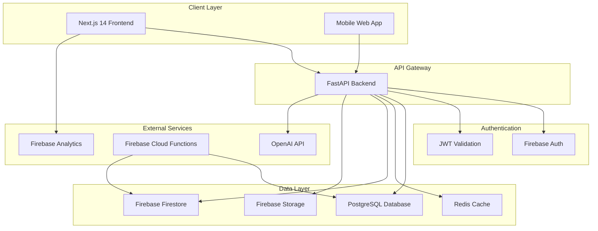

# Design Document

## Overview

The ArambhGPT Platform Foundation is designed as a modern, scalable web application with a microservices architecture. The system uses Next.js 14 with App Router for the frontend, FastAPI for the backend API, Firebase for authentication and cloud services, PostgreSQL for data persistence, and Redis for caching and real-time features. The architecture emphasizes performance, security, and cultural appropriateness for South Asian users.

## Architecture

### High-Level Architecture



### Technology Stack

**Frontend:**
- Next.js 14 with App Router for server-side rendering and routing
- TypeScript for type safety and developer experience
- Tailwind CSS for utility-first styling
- Lucide React for consistent iconography
- Noto Sans Devanagari for Hindi/Urdu typography

**Backend:**
- Python FastAPI with async/await for high-performance API
- Pydantic for data validation and serialization
- Firebase Admin SDK for authentication verification
- Prisma ORM for type-safe database operations

**Database & Caching:**
- PostgreSQL as primary relational database
- Redis for session storage, caching, and pub/sub
- Firebase Firestore for real-time data synchronization

**Cloud Services:**
- Firebase Authentication for user management
- Firebase Storage for file uploads
- Firebase Cloud Functions for serverless operations
- Firebase Analytics for user behavior tracking
- Firebase Cloud Messaging for push notifications

## Components and Interfaces

### Frontend Components

#### Core Layout Components
- **AppLayout**: Main application wrapper with navigation and branding
- **Header**: Navigation bar with Lotus logo and user authentication status
- **Sidebar**: Navigation menu with Hindi/Urdu language support
- **Footer**: Cultural branding and links

#### Authentication Components
- **LoginForm**: Firebase Authentication integration
- **SignupForm**: User registration with cultural considerations
- **ProfileManager**: User profile management with multilingual support

#### UI Components
- **Button**: Branded buttons with teal/orange gradient theme
- **Input**: Form inputs with RTL support for Urdu
- **Modal**: Accessible modals with proper focus management
- **LoadingSpinner**: Branded loading indicators

### Backend API Interfaces

#### Authentication Endpoints
```python
@router.post("/auth/verify")
async def verify_token(token: str) -> UserProfile

@router.post("/auth/refresh")
async def refresh_token(refresh_token: str) -> TokenPair
```

#### User Management Endpoints
```python
@router.get("/users/profile")
async def get_user_profile(user_id: str) -> UserProfile

@router.put("/users/profile")
async def update_user_profile(user_id: str, profile: UserProfileUpdate) -> UserProfile
```

#### AI Integration Endpoints
```python
@router.post("/ai/chat")
async def process_chat(message: ChatMessage, user_id: str) -> ChatResponse

@router.post("/ai/translate")
async def translate_text(text: str, target_language: str) -> TranslationResponse
```

### Database Schema Design

#### Core Tables
```sql
-- Users table
CREATE TABLE users (
    id UUID PRIMARY KEY DEFAULT gen_random_uuid(),
    firebase_uid VARCHAR(128) UNIQUE NOT NULL,
    email VARCHAR(255) UNIQUE NOT NULL,
    display_name VARCHAR(100),
    preferred_language VARCHAR(10) DEFAULT 'en',
    created_at TIMESTAMP DEFAULT CURRENT_TIMESTAMP,
    updated_at TIMESTAMP DEFAULT CURRENT_TIMESTAMP
);

-- User sessions for Redis caching
CREATE TABLE user_sessions (
    id UUID PRIMARY KEY DEFAULT gen_random_uuid(),
    user_id UUID REFERENCES users(id),
    session_token VARCHAR(255) UNIQUE NOT NULL,
    expires_at TIMESTAMP NOT NULL,
    created_at TIMESTAMP DEFAULT CURRENT_TIMESTAMP
);

-- Chat conversations
CREATE TABLE conversations (
    id UUID PRIMARY KEY DEFAULT gen_random_uuid(),
    user_id UUID REFERENCES users(id),
    title VARCHAR(255),
    language VARCHAR(10) DEFAULT 'en',
    created_at TIMESTAMP DEFAULT CURRENT_TIMESTAMP,
    updated_at TIMESTAMP DEFAULT CURRENT_TIMESTAMP
);

-- Chat messages
CREATE TABLE messages (
    id UUID PRIMARY KEY DEFAULT gen_random_uuid(),
    conversation_id UUID REFERENCES conversations(id),
    content TEXT NOT NULL,
    role VARCHAR(20) NOT NULL, -- 'user' or 'assistant'
    language VARCHAR(10),
    created_at TIMESTAMP DEFAULT CURRENT_TIMESTAMP
);
```

## Data Models

### TypeScript Interfaces (Frontend)

```typescript
interface UserProfile {
  id: string;
  firebaseUid: string;
  email: string;
  displayName?: string;
  preferredLanguage: 'en' | 'hi' | 'ur';
  createdAt: Date;
  updatedAt: Date;
}

interface ChatMessage {
  id: string;
  conversationId: string;
  content: string;
  role: 'user' | 'assistant';
  language: string;
  createdAt: Date;
}

interface Conversation {
  id: string;
  userId: string;
  title: string;
  language: string;
  messages: ChatMessage[];
  createdAt: Date;
  updatedAt: Date;
}
```

### Python Models (Backend)

```python
from pydantic import BaseModel
from typing import Optional, List
from datetime import datetime

class UserProfile(BaseModel):
    id: str
    firebase_uid: str
    email: str
    display_name: Optional[str] = None
    preferred_language: str = 'en'
    created_at: datetime
    updated_at: datetime

class ChatMessage(BaseModel):
    id: str
    conversation_id: str
    content: str
    role: str  # 'user' or 'assistant'
    language: str
    created_at: datetime

class ChatRequest(BaseModel):
    message: str
    conversation_id: Optional[str] = None
    language: str = 'en'

class ChatResponse(BaseModel):
    message: ChatMessage
    conversation_id: str
```

## Error Handling

### Frontend Error Handling
- **Network Errors**: Retry mechanism with exponential backoff
- **Authentication Errors**: Automatic token refresh and redirect to login
- **Validation Errors**: User-friendly error messages in preferred language
- **API Errors**: Graceful degradation with offline capabilities

### Backend Error Handling
- **Authentication Failures**: Return 401 with clear error messages
- **Validation Errors**: Return 422 with field-specific error details
- **Database Errors**: Log errors and return generic 500 responses
- **External API Failures**: Implement circuit breaker pattern for OpenAI API
- **Rate Limiting**: Implement per-user rate limits with Redis

### Error Response Format
```python
class ErrorResponse(BaseModel):
    error: str
    message: str
    details: Optional[dict] = None
    timestamp: datetime
    request_id: str
```

## Testing Strategy

### Frontend Testing
- **Unit Tests**: Jest and React Testing Library for component testing
- **Integration Tests**: Cypress for end-to-end user flows
- **Accessibility Tests**: axe-core for WCAG compliance
- **Visual Regression Tests**: Chromatic for UI consistency
- **Internationalization Tests**: Verify Hindi/Urdu text rendering

### Backend Testing
- **Unit Tests**: pytest for individual function testing
- **Integration Tests**: TestClient for API endpoint testing
- **Database Tests**: Test database operations with test containers
- **Authentication Tests**: Mock Firebase Admin SDK for auth testing
- **Performance Tests**: Load testing with locust

### Firebase Testing
- **Security Rules Tests**: Firebase emulator for Firestore rules
- **Cloud Functions Tests**: Local emulator testing
- **Authentication Flow Tests**: Test various auth providers

### Infrastructure Testing
- **Docker Container Tests**: Verify containerized deployments
- **Environment Configuration Tests**: Test different deployment environments
- **Database Migration Tests**: Verify schema changes work correctly

### Continuous Integration
- **Pre-commit Hooks**: ESLint, Prettier, and type checking
- **Automated Testing**: Run all test suites on pull requests
- **Code Coverage**: Maintain >80% coverage for critical paths
- **Security Scanning**: Automated vulnerability scanning
- **Performance Monitoring**: Track bundle size and API response times