# Design Document

## Overview

The ArambhGPT Professional Network Integration system is designed as a comprehensive platform for mental health professionals that combines rigorous credentialing, cultural competency validation, and AI-assisted therapeutic tools. The architecture supports the complete therapist lifecycle from onboarding through ongoing practice management, with emphasis on cultural sensitivity and quality assurance. The system seamlessly integrates AI insights with human therapeutic expertise to enhance care delivery.

## Architecture

### Professional Network Architecture

```mermaid
graph TB
    subgraph "Therapist Onboarding Layer"
        A[Registration Portal]
        B[Credential Verification Service]
        C[Background Check Integration]
        D[Cultural Competency Assessment]
        E[Platform Training System]
    end
    
    subgraph "Profile Management Layer"
        F[Professional Profile Builder]
        G[Specialization Management]
        H[Cultural Expertise Tracker]
        I[Availability Calendar System]
        J[Pricing Management]
    end
    
    subgraph "Quality Assurance Layer"
        K[Supervision Management]
        L[Peer Review System]
        M[Client Feedback Analyzer]
        N[Continuing Education Tracker]
        O[Crisis Protocol Certification]
    end
    
    subgraph "Client Management Layer"
        P[AI Client Analysis Engine]
        Q[Cultural Context Provider]
        R[Session History Manager]
        S[Risk Assessment System]
        T[Family Dynamics Analyzer]
    end
    
    subgraph "Session Tools Layer"
        U[WebRTC Session Manager]
        V[Real-time Emotion Monitor]
        W[Cultural Prompt System]
        X[Therapeutic Recommendation Engine]
        Y[Crisis Intervention Protocols]
    end
    
    subgraph "Analytics and Performance Layer"
        Z[Outcome Measurement System]
        AA[Performance Analytics Dashboard]
        BB[Cultural Effectiveness Tracker]
        CC[Professional Development Advisor]
        DD[Peer Comparison Engine]
    end
    
    subgraph "AI-Human Collaboration Layer"
        EE[Pre-session AI Analysis]
        FF[Real-time Session Assistance]
        GG[Post-session Recommendations]
        HH[Crisis Detection Support]
        II[Cultural Competency Enhancement]
    end
    
    A --> B
    B --> C
    C --> D
    D --> E
    E --> F
    F --> G
    G --> H
    H --> I
    I --> J
    J --> K
    K --> L
    L --> M
    M --> N
    N --> O
    O --> P
    P --> Q
    Q --> R
    R --> S
    S --> T
    T --> U
    U --> V
    V --> W
    W --> X
    X --> Y
    Y --> Z
    Z --> AA
    AA --> BB
    BB --> CC
    CC --> DD
    DD --> EE
    EE --> FF
    FF --> GG
    GG --> HH
    HH --> II
```



### Technology Stack

**Backend Services:**
- FastAPI for therapist management APIs
- Firebase Admin SDK for authentication and data management
- PostgreSQL for therapist profiles and performance data
- Redis for session state and real-time features
- WebRTC for video/audio session capabilities

**AI Integration:**
- Custom AI models for client analysis and cultural context
- OpenAI GPT-4 for therapeutic recommendations
- Real-time emotion detection APIs
- Cultural competency assessment algorithms

**Quality Assurance:**
- Automated compliance monitoring systems
- Peer review workflow management
- Performance analytics and reporting
- Continuing education tracking systems

## Components and Interfaces

### Therapist Onboarding System

#### Registration and Verification Service
```python
from typing import Dict, List, Optional
from dataclasses import dataclass
from enum import Enum

class VerificationStatus(Enum):
    PENDING = "pending"
    IN_PROGRESS = "in_progress"
    APPROVED = "approved"
    REJECTED = "rejected"
    REQUIRES_ADDITIONAL_INFO = "requires_additional_info"

class CulturalCompetencyLevel(Enum):
    BASIC = "basic"
    INTERMEDIATE = "intermediate"
    ADVANCED = "advanced"
    EXPERT = "expert"

@dataclass
class TherapistCredentials:
    license_number: str
    license_state: str
    license_expiry: str
    degree_type: str
    degree_institution: str
    degree_year: int
    specializations: List[str]
    years_experience: int
    
@dataclass
class CulturalCompetency:
    regions: List[str]
    communities: List[str]
    languages: Dict[str, str]  # language: fluency_level
    religious_awareness: List[str]
    cultural_training: List[str]
    competency_level: CulturalCompetencyLevel

class TherapistOnboardingService:
    def __init__(self):
        self.credential_verifier = CredentialVerificationService()
        self.background_checker = BackgroundCheckService()
        self.cultural_assessor = CulturalCompetencyAssessor()
        self.training_manager = PlatformTrainingManager()
    
    async def initiate_onboarding(
        self, 
        therapist_data: Dict
    ) -> str:
        """
        Start the therapist onboarding process
        """
        # Create onboarding record
        onboarding_id = await self._create_onboarding_record(therapist_data)
        
        # Initiate credential verification
        await self.credential_verifier.verify_credentials(
            onboarding_id, therapist_data['credentials']
        )
        
        # Start background check
        await self.background_checker.initiate_background_check(
            onboarding_id, therapist_data['personal_info']
        )
        
        # Schedule cultural competency assessment
        await self.cultural_assessor.schedule_assessment(
            onboarding_id, therapist_data['cultural_background']
        )
        
        return onboarding_id
    
    async def verify_professional_credentials(
        self, 
        credentials: TherapistCredentials
    ) -> Dict:
        """
        Verify therapist professional credentials
        """
        verification_results = {
            'license_valid': False,
            'degree_verified': False,
            'specializations_confirmed': False,
            'experience_validated': False,
            'overall_status': VerificationStatus.PENDING
        }
        
        # Verify license with state board
        license_verification = await self._verify_license(
            credentials.license_number, credentials.license_state
        )
        verification_results['license_valid'] = license_verification['valid']
        
        # Verify educational credentials
        degree_verification = await self._verify_degree(
            credentials.degree_institution, 
            credentials.degree_type, 
            credentials.degree_year
        )
        verification_results['degree_verified'] = degree_verification['verified']
        
        # Validate specializations
        specialization_validation = await self._validate_specializations(
            credentials.specializations, credentials.years_experience
        )
        verification_results['specializations_confirmed'] = specialization_validation['valid']
        
        # Calculate overall status
        if all([
            verification_results['license_valid'],
            verification_results['degree_verified'],
            verification_results['specializations_confirmed']
        ]):
            verification_results['overall_status'] = VerificationStatus.APPROVED
        else:
            verification_results['overall_status'] = VerificationStatus.REQUIRES_ADDITIONAL_INFO
        
        return verification_results
    
    async def assess_cultural_competency(
        self, 
        therapist_id: str,
        cultural_background: Dict
    ) -> CulturalCompetency:
        """
        Assess therapist's cultural competency
        """
        # Conduct cultural awareness assessment
        cultural_assessment = await self._conduct_cultural_assessment(
            therapist_id, cultural_background
        )
        
        # Evaluate language proficiencies
        language_evaluation = await self._evaluate_language_skills(
            therapist_id, cultural_background.get('languages', [])
        )
        
        # Assess cultural training and experience
        training_assessment = await self._assess_cultural_training(
            cultural_background.get('cultural_training', [])
        )
        
        # Determine competency level
        competency_level = await self._calculate_competency_level(
            cultural_assessment, language_evaluation, training_assessment
        )
        
        return CulturalCompetency(
            regions=cultural_background.get('regions', []),
            communities=cultural_background.get('communities', []),
            languages=language_evaluation,
            religious_awareness=cultural_background.get('religious_awareness', []),
            cultural_training=cultural_background.get('cultural_training', []),
            competency_level=competency_level
        )
```

### Professional Profile Management

#### Profile Builder and Management System
```python
@dataclass
class TherapistProfile:
    therapist_id: str
    personal_info: Dict
    credentials: TherapistCredentials
    cultural_competency: CulturalCompetency
    specializations: List[str]
    availability: Dict
    pricing: Dict
    performance_metrics: Dict
    verification_status: VerificationStatus

class ProfessionalProfileManager:
    def __init__(self):
        self.profile_builder = ProfileBuilder()
        self.availability_manager = AvailabilityManager()
        self.pricing_manager = PricingManager()
        self.specialization_manager = SpecializationManager()
    
    async def create_therapist_profile(
        self, 
        therapist_data: Dict,
        verification_results: Dict
    ) -> TherapistProfile:
        """
        Create comprehensive therapist profile
        """
        # Build basic profile structure
        profile = await self.profile_builder.build_profile(therapist_data)
        
        # Setup specialization tags
        specializations = await self.specialization_manager.setup_specializations(
            therapist_data['specializations'],
            therapist_data['experience']
        )
        
        # Configure availability calendar
        availability = await self.availability_manager.setup_availability(
            therapist_data['availability_preferences'],
            therapist_data['timezone']
        )
        
        # Setup pricing structure
        pricing = await self.pricing_manager.configure_pricing(
            therapist_data['pricing_preferences'],
            specializations
        )
        
        return TherapistProfile(
            therapist_id=profile['therapist_id'],
            personal_info=profile['personal_info'],
            credentials=profile['credentials'],
            cultural_competency=profile['cultural_competency'],
            specializations=specializations,
            availability=availability,
            pricing=pricing,
            performance_metrics={},
            verification_status=verification_results['overall_status']
        )
    
    async def update_cultural_expertise(
        self, 
        therapist_id: str,
        cultural_updates: Dict
    ) -> Dict:
        """
        Update therapist's cultural expertise areas
        """
        current_profile = await self._get_therapist_profile(therapist_id)
        
        # Update cultural competency areas
        updated_competency = await self._update_cultural_competency(
            current_profile.cultural_competency,
            cultural_updates
        )
        
        # Reassess competency level if needed
        if cultural_updates.get('requires_reassessment', False):
            updated_competency = await self.assess_cultural_competency(
                therapist_id, cultural_updates
            )
        
        # Update profile
        await self._update_profile_field(
            therapist_id, 'cultural_competency', updated_competency
        )
        
        return {
            'updated_competency': updated_competency,
            'reassessment_required': cultural_updates.get('requires_reassessment', False),
            'update_timestamp': datetime.utcnow()
        }
```

### Quality Assurance Framework

#### Supervision and Quality Management
```python
@dataclass
class SupervisionSession:
    session_id: str
    therapist_id: str
    supervisor_id: str
    session_date: datetime
    duration_minutes: int
    topics_discussed: List[str]
    feedback: str
    action_items: List[str]
    next_session_date: datetime

@dataclass
class QualityMetrics:
    client_satisfaction_avg: float
    session_completion_rate: float
    cultural_sensitivity_score: float
    crisis_handling_effectiveness: float
    professional_development_progress: float

class QualityAssuranceManager:
    def __init__(self):
        self.supervision_scheduler = SupervisionScheduler()
        self.peer_review_system = PeerReviewSystem()
        self.feedback_analyzer = ClientFeedbackAnalyzer()
        self.education_tracker = ContinuingEducationTracker()
    
    async def schedule_monthly_supervision(
        self, 
        therapist_id: str,
        supervisor_preferences: Dict
    ) -> str:
        """
        Schedule required monthly supervision session
        """
        # Find available supervisor
        supervisor = await self._find_available_supervisor(
            therapist_id, supervisor_preferences
        )
        
        # Schedule supervision session
        session_id = await self.supervision_scheduler.schedule_session(
            therapist_id=therapist_id,
            supervisor_id=supervisor['supervisor_id'],
            preferred_times=supervisor_preferences.get('preferred_times', []),
            session_type='monthly_supervision'
        )
        
        # Prepare supervision materials
        await self._prepare_supervision_materials(therapist_id, session_id)
        
        return session_id
    
    async def conduct_peer_review(
        self, 
        therapist_id: str,
        case_data: Dict
    ) -> Dict:
        """
        Facilitate peer review and case consultation
        """
        # Anonymize case data
        anonymized_case = await self._anonymize_case_data(case_data)
        
        # Select peer reviewers
        peer_reviewers = await self._select_peer_reviewers(
            therapist_id, case_data['specialization_area']
        )
        
        # Initiate peer review process
        review_session_id = await self.peer_review_system.initiate_review(
            case_data=anonymized_case,
            reviewers=peer_reviewers,
            requesting_therapist=therapist_id
        )
        
        return {
            'review_session_id': review_session_id,
            'peer_reviewers': peer_reviewers,
            'estimated_completion': datetime.utcnow() + timedelta(days=7)
        }
    
    async def analyze_client_feedback(
        self, 
        therapist_id: str,
        feedback_period: str = 'monthly'
    ) -> Dict:
        """
        Analyze client feedback and create improvement plans
        """
        # Collect feedback data
        feedback_data = await self._collect_client_feedback(
            therapist_id, feedback_period
        )
        
        # Analyze feedback patterns
        feedback_analysis = await self.feedback_analyzer.analyze_feedback(
            feedback_data
        )
        
        # Generate improvement recommendations
        improvement_plan = await self._generate_improvement_plan(
            therapist_id, feedback_analysis
        )
        
        # Track cultural sensitivity feedback specifically
        cultural_feedback = await self._analyze_cultural_sensitivity_feedback(
            feedback_data
        )
        
        return {
            'overall_satisfaction': feedback_analysis['satisfaction_score'],
            'cultural_sensitivity_score': cultural_feedback['sensitivity_score'],
            'improvement_areas': feedback_analysis['improvement_areas'],
            'improvement_plan': improvement_plan,
            'feedback_trends': feedback_analysis['trends']
        }
```

### AI-Human Collaboration Tools

#### Session Assistance and AI Integration
```python
@dataclass
class PreSessionAnalysis:
    client_id: str
    emotional_state_prediction: Dict
    cultural_context: Dict
    risk_indicators: List[str]
    recommended_approaches: List[str]
    session_preparation_notes: str

@dataclass
class RealTimeSessionInsights:
    emotional_state_changes: List[Dict]
    cultural_cues_detected: List[str]
    intervention_suggestions: List[str]
    crisis_risk_level: str
    engagement_level: float

class AIHumanCollaborationManager:
    def __init__(self):
        self.client_analyzer = AIClientAnalyzer()
        self.cultural_context_provider = CulturalContextProvider()
        self.session_monitor = RealTimeSessionMonitor()
        self.recommendation_engine = TherapeuticRecommendationEngine()
    
    async def generate_pre_session_analysis(
        self, 
        therapist_id: str,
        client_id: str,
        session_id: str
    ) -> PreSessionAnalysis:
        """
        Generate AI-powered pre-session client analysis
        """
        # Analyze client's recent interactions and emotional state
        client_analysis = await self.client_analyzer.analyze_client_state(
            client_id, lookback_days=7
        )
        
        # Gather cultural context and considerations
        cultural_context = await self.cultural_context_provider.get_cultural_context(
            client_id, therapist_id
        )
        
        # Assess risk indicators
        risk_assessment = await self._assess_client_risk_indicators(
            client_id, client_analysis
        )
        
        # Generate therapeutic approach recommendations
        approach_recommendations = await self.recommendation_engine.recommend_approaches(
            client_analysis, cultural_context, risk_assessment
        )
        
        # Prepare session notes
        session_notes = await self._prepare_session_notes(
            client_analysis, cultural_context, approach_recommendations
        )
        
        return PreSessionAnalysis(
            client_id=client_id,
            emotional_state_prediction=client_analysis['emotional_state'],
            cultural_context=cultural_context,
            risk_indicators=risk_assessment['risk_indicators'],
            recommended_approaches=approach_recommendations,
            session_preparation_notes=session_notes
        )
    
    async def provide_real_time_session_assistance(
        self, 
        session_id: str,
        session_data: Dict
    ) -> RealTimeSessionInsights:
        """
        Provide real-time AI assistance during therapy sessions
        """
        # Monitor emotional state changes
        emotional_monitoring = await self.session_monitor.monitor_emotional_state(
            session_data['audio_stream'], session_data['video_stream']
        )
        
        # Detect cultural cues and context
        cultural_cues = await self._detect_cultural_cues(
            session_data['conversation_transcript']
        )
        
        # Generate intervention suggestions
        intervention_suggestions = await self._generate_intervention_suggestions(
            emotional_monitoring, cultural_cues, session_data['client_profile']
        )
        
        # Assess crisis risk in real-time
        crisis_risk = await self._assess_real_time_crisis_risk(
            emotional_monitoring, session_data['conversation_transcript']
        )
        
        # Calculate engagement level
        engagement_level = await self._calculate_engagement_level(
            session_data['client_responses'], emotional_monitoring
        )
        
        return RealTimeSessionInsights(
            emotional_state_changes=emotional_monitoring['state_changes'],
            cultural_cues_detected=cultural_cues,
            intervention_suggestions=intervention_suggestions,
            crisis_risk_level=crisis_risk['risk_level'],
            engagement_level=engagement_level
        )
    
    async def generate_post_session_recommendations(
        self, 
        session_id: str,
        session_summary: Dict
    ) -> Dict:
        """
        Generate post-session follow-up recommendations
        """
        # Analyze session outcomes
        session_analysis = await self._analyze_session_outcomes(
            session_summary
        )
        
        # Generate follow-up recommendations
        follow_up_recommendations = await self._generate_follow_up_recommendations(
            session_analysis, session_summary['client_progress']
        )
        
        # Assess cultural adaptation effectiveness
        cultural_effectiveness = await self._assess_cultural_adaptation_effectiveness(
            session_summary['cultural_interventions_used'],
            session_summary['client_response']
        )
        
        # Generate homework and between-session activities
        homework_suggestions = await self._generate_culturally_appropriate_homework(
            session_analysis, session_summary['client_cultural_background']
        )
        
        return {
            'session_effectiveness_score': session_analysis['effectiveness_score'],
            'follow_up_recommendations': follow_up_recommendations,
            'cultural_adaptation_score': cultural_effectiveness['adaptation_score'],
            'homework_suggestions': homework_suggestions,
            'next_session_focus': session_analysis['recommended_next_focus']
        }
```

## Data Models

### Core Professional Network Models
```python
@dataclass
class TherapistPerformanceMetrics:
    therapist_id: str
    period_start: datetime
    period_end: datetime
    total_sessions: int
    completed_sessions: int
    client_satisfaction_avg: float
    cultural_sensitivity_score: float
    crisis_handling_effectiveness: float
    professional_development_hours: int
    peer_review_score: float

@dataclass
class ClientTherapistMatch:
    match_id: str
    client_id: str
    therapist_id: str
    match_score: float
    cultural_compatibility: float
    specialization_alignment: float
    language_match: bool
    availability_compatibility: float
    match_reasoning: str

@dataclass
class SessionQualityMetrics:
    session_id: str
    therapeutic_alliance_score: float
    cultural_sensitivity_score: float
    intervention_effectiveness: float
    client_engagement_level: float
    crisis_management_quality: float
    overall_session_quality: float
```

## Error Handling

### Professional Network Error Management
- **Credential Verification Failures**: Handle external verification service outages
- **Cultural Assessment Errors**: Provide fallback assessment methods
- **Session Tool Failures**: Ensure backup communication methods
- **AI Assistance Outages**: Maintain core therapeutic functionality
- **Quality Assurance Gaps**: Automated alerts for missed supervision or reviews

### Compliance and Professional Standards
- **License Expiration Monitoring**: Automated alerts and suspension protocols
- **Supervision Requirement Tracking**: Ensure compliance with professional standards
- **Crisis Protocol Failures**: Immediate escalation and backup procedures
- **Cultural Sensitivity Violations**: Rapid response and remediation protocols
- **Professional Boundary Maintenance**: Automated monitoring and intervention

## Testing Strategy

### Professional Network Testing
- **Onboarding Workflow Testing**: Complete therapist registration and verification
- **Cultural Competency Assessment**: Validate assessment accuracy and fairness
- **AI-Human Collaboration**: Test seamless integration of AI assistance
- **Quality Assurance Processes**: Validate supervision and peer review workflows
- **Performance Analytics**: Test accuracy of metrics and reporting

### Integration Testing
- **Client-Therapist Matching**: Test matching algorithm effectiveness
- **Session Management**: Validate complete session lifecycle
- **Crisis Intervention**: Test emergency protocols and escalation
- **Cultural Adaptation**: Validate cultural sensitivity across diverse scenarios
- **Professional Development**: Test continuing education and improvement tracking